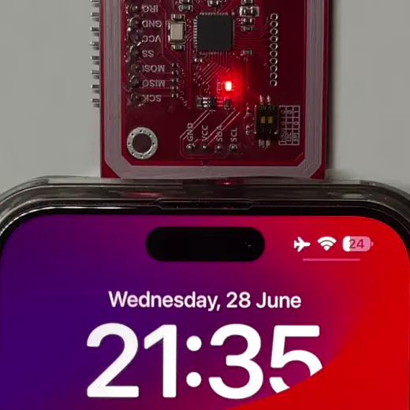

# Apple Home Key

<p float="left">
 
</p>
<sub>No, it's not Photoshop, although there's a trick involved</sub>
<br>

# Notes

⚠️Reverse-engineering of a Home Key protocol has not yet been completed and thus this repository does not provide complete specification as to how to replicate the protocol. The main goal of this document is to provide a starting point for people that plan on researching this topic to save their time and to help with collaboration.  
Information already available inclues:  
- What standard Home Key is based on;
- HomeKit:
    - How the lock is configured via HomeKit;
    - Primitives, operations;
    - Common data structures;
- NFC:
    - ECP;
    - Applets are used;
    - Which commands are used;
    - What is the content of command payloads;
    - What is the expected command response format.

There are two problems solving which could help complete the reverse-engineering:
1. Analysing HomeKit traffic on a real lock:  
    Right now we know which data is being written and read from a lock as HomeKit does it even with a virtual lock, being able to look at communication with a real device (I assume it can be done via a BLE HomeKit MITM) could help us to understand data structures more in-depth;
2. Decrypting NFC data:  
    Data transferred in NFC protocol is encrypted using a common derived key. As of now we know how to get the keys, but a problem remains regarding the KDF, as Apple have switched up the static values in order to make reverse-engineering more difficult. This is the main issue regarding the protocol. Possible solutions could involve:  
    - Brute forcing possible static shared info part variants, knowing all keys and an approximate decrypted data format. If a combination of words is used this is doeable, otherwise pure luck or SOL.
    - A divine intervention.


If you can help with any of the issues, I'm ready to cooperate and provide sample data. Feel free to create an issue or a PR.

**Information published here is not in final form. Many ammendments are planned to be done throughout this week to make this document fully self-sufficient**

# Overview

Apple Home Key is an NFC protocol used by select HomeKit certified locks to authenticate a user using a virtual key provisioned into their Apple device.  

This protocol is largely based on a [Car Key](https://developer.apple.com/videos/play/wwdc2020/10006/) standard (look at references), although there are some changes in regards to initial provisioning/pairing to adapt to HomeKit, plus static shared info used during KDF has been changed, presumably to protect against people like the ones writing this text right now.

Just like tha parent protocol, Home Key has following advantages:
- This protocol provides reader authentication, data encryption, forward secrecy;
- It provides a "Mailbox" mechanism that allows to sync lock configuration data even in situations when a lock is not connected to the internet:
    - Key revocations;
    - Invitations;
    - Attestations.
- It allows to freely share keys (although this functionality is disabled due to some reason);
- In theory, future locks could implement UWB-based access as it's supported by specification.


# HomeKit

Information in this section is based on info found by [@KhaosT](https://github.com/KhaosT) for [HAP-NodeJS](https://github.com/homebridge/HAP-NodeJS);
HomeKit data is encoded in a [TLV8](https://pypi.org/project/tlv8/) format;

## Device configuration

A lock that implements a Home Key has to have an NFCAccess(`00000266-0000-1000-8000-0026BB765291`) service that has following characteristics:
- ConfigurationState(`00000263-0000-1000-8000-0026BB765291`):  
    Format: UINT16  
    Operations: NOTIFY, READ  
    Usage: Unknown
- NFCAccessControlPoint(`00000264-0000-1000-8000-0026BB765291`):  
    Format: TLV8  
    Operations: READ, WRITE, WRITE_RESPONSE  
    Usage: This characteristic is the first one being written to when a new lock is provisioned into a home. This data presumably includes:
    - Reader private key for Home Key authentication;
    - Public keys of devices that belong to members of a home;
- NFCAccessSupportedConfiguration(`00000265-0000-1000-8000-0026BB765291`):  
    Format: TLV8  
    Operations: READ  
    Usage: Unknown, presumably to read lock information, such as:
    - Maximum amount of key slots;
    - Key slot configuration/state;
    - Extra features?

## Characteristics operations

This section will describe data structures being written to NFCAccessControlPoint characteristic;

Prematurely, following are known:
- HomeKey Home private key provisioning;
- Buddy device provisioning;
- Invitation provisioning.


### NFCAccessControlPoint

### Initial provisioning?
Base64 form:
```
AQECBi8BAQICILB5zId948J7jdYynrEQIRDIJXDSaIA42zmPSDIICVhyAwgzsYDX7dNcBQ==
```

TLV form:
```
06[2f]:
  01[01]: # Comand type? Version?
   02
  02[20]: # Private key
   b079cc877de3c27b8dd6329eb1102110c82570d2688038db398f483208095872
  03[08]: # Identifier
   33b180d7edd35c05
```

This command seems to contain some sort of an identifier, version, plus private reader key used later in NFC transaction (verified, different values don't work).

### Device addition?
Base64 form:
```
AQECBi8BAQICILB5zId948J7jdYynrEQIRDIJXDSaIA42zmPSDIICVhyAwgzsYDX7dNcBQ==
```

TLV form:
```
04[52]:
  01[01]: # Command type?
   02
  02[40]: # Device public key?
   e7b0092112fcd6f0eee447287dc90a790804ed6a4aad4f64fc883b188b4b6ff2a24f6cf0cf4bd88198f497207dc7c62ff578e44ae6777fd7621a2915094acad4
  03[08]: # Device identifier?
   12d6efc47354c4a4
  04[01]: # Slot identifier?
   01
```

This command seems to contain some sort of an identifier, version, plus a public EC key (with both points lacking a sign). I have no info on how this data is used as I haven't reached a needed step.


### Tiny thingy?
Base64 form:
```
AQEBBgA=
```

TLV form:
```
01[01]:
  01
06[00]:
```

What is this????


**TODO Provide examples and explanation** 

## Key Color

A home device may have a AccessoryInformation(`0000003E-0000-1000-8000-0026BB765291`) service, which has a RO HardwareFinish(`0000026C-0000-1000-8000-0026BB765291`) characteristic. 

Hardware finish is a TLV8 with a following format:
```
    01[04]:    # Field 1
      000000   # Color HEX
      00       # Unknown (opacity?)
```

**HardwareFinish of the first lock added to your home installation influences the color of the lock art for the whole home.**

Following finish variations are mentioned in IOS system files:

   | Color  | Art                                                                                  | Value      | Notes                                                                                                |
   | ------ | ------------------------------------------------------------------------------------ | ---------- | ---------------------------------------------------------------------------------------------------- |
   | Black  |    | `00 00 00` |                                                                                                      |
   | Gold   |      | ?? ?? ??   |                                                                                                      |
   | Silver |  | ?? ?? ??   | Not `FF FF FF`                                                                                                     |
   | Tan    |        | ?? ?? ??   | The default color. If an unexisting color combo is chosen, this color will be selected as a fallback |
    
<sub>I've tried finding the colors by taking the hex values from the original pass image, but there is no direct correlation between them, so don't bother</sub>

# NFC

## ECP

[ECP](https://github.com/kormax/apple-enhanced-contactless-polling) allows Home Keys to work via express mode and is required to be implemented by certified locks.

Full Home Key ECP frame looks like this

```
   6a 02 cb 02 06 021100 deadbeefdeadbeef
```

Following characteristics can be noted:
- It belongs to the Access(`02`) reader group  with a dedicated subtype HomeKey(`06`);
- It contains a single 3-byte TCI with a value of `02 11 00`, no other variations have been met. IOS file system contains multiple copies of a Home Key pass json with this TCI;
- The final 8 bytes of an ECP Home Key frame contain reader group identifier, which allows IOS to differentiate between keys for different Home installations.  

(NOTE) Actual reader identifier is 16 bytes long, first 8 bytes are the same for all locks in a single home, while the latter 8 are unique to each one. First 8 are used for ECP.  
(BUG) If more than one Home Key is added to a device, ECP stops working correctly, as a device responds to any reader emitting Home Key ECP frame even if the reader identifier is not known to it.  
(BUG) If you disable express mode for a single key while having multiple with enabled express mode, it won't appear on a screen when brought near to a reader. Disabling express mode for all home keys fixes this issue.

## Applets and Application Identifiers

Home Key uses two application identifiers:
1. Home Key Primary:  
    `A0000008580101`. Primary, used for most commands;
2. Home Key Configuration:  
    `A0000008580102`. Used for mailbox synchronization, can only be selected after a successful authentication with a primary applet.

In most situations a reader will only use the Primary applet, Configuration will be selected only:
- When a secondary device (a watch) is authenticated for the first time;
- If a new person is invited and a key data hasn't been provisioned into a lock prior to that;
- After key revocation;

There might be more instances when mailbox is used. This information might change as we are able to research the protocol more in-depth.

## Command overview

   | Command name                  | CLA | INS | P1    | P2   | DATA                       | LE  | Notes                       |
   | ----------------------------- | --- | --- | ----- | ---- | -------------------------- | --- | --------------------------- |
   | SELECT Home Key               | 00  | A4  | 04    | 00   | Home Key AID               | 00  |                             |
   | FAST                          | 80  | 80  | FLAGS | TYPE | TLV encoded data           | 00  | Data format described below |
   | STANDARD                      | 80  | 81  | 00    | 00   | TLV encoded data           |     | Data format described below |
   | EXCHANGE                      | 80  | 84  |       |      | Encrypted TLV encoded data |     | Data format described below |
   | CONTROL FLOW                  | 80  | 3c  | STEP  | INFO |                            |     | No data, used purely for UX |
   | Select Home Key Configuration | 00  | A4  | 04    | 00   | Home Key Configuration AID | 00  |                             |

Commands are executed in a following sequence:
1. SELECT:  
    Reader transmits Home Key AID; Device responds with a version list TLV;
    Reader has to verify that there is a protocol version match between a list provided by a device and itself;
2. FAST:  
    Reader transmits required protocol version, transaction nonce, ephemeral public EC key, and its identifier;  
    Device responds with an authentication cryptogram and its own ephemeral public EC key;  
    Reader tries to verify that cryptogram was generated by a known device with a beforementioned encryption key;  
    A) If cryptograms match and there is no data to synchronize, authentication is confirmed and session is completed;  
    B) If there's a cryptogram mismatch or there is data to synchronize, we continue the command flow;
3. STANDARD:  
    Reader combines keys, nonces, other data exchanged during the transaction and signs it using its own private key;
    A device verifies that a signature is valid, and returns an encrypted payload containing signature of the transaction data using the device key;
    Common keys are established during this step to be used in FAST command in next communications. **This is the step that's not yet solved**
4. EXCHANGE:  
    Using the established encrypted channel, reader can request or write information from/in mailbox.  
    In some yet unresearched cases for a separate configuration applet is selected to exchange more data, presumably for attestation exchange.
*  CONTROL FLOW:
    Used in between other commands to communicate transaction state to the device. This command is reponsible for UX, such as:
    - Success checkmark;
    - Failure exclamation mark;
    - Error messages;


**TODO Add command overview for configuration applet**

## Commands

This section will describe following aspects of each command separately:
- command data;
- p1, p2;
- status words;
- response data.
- nested data structures;

### Select

#### Request

##### Overview

| CLA | INS | P1  | P2  | DATA             | LE  |
| --- | --- | --- | --- | ---------------- | --- |
| 00  | A4  | 04  | 00  | `A0000008580101` | 00  |

#### Response 

##### Overview

| DATA                 | SW1 | SW2 |
| -------------------- | --- | --- |
| Refer to data format | 90  | 00  |

Any response rather than `9000` means that applet is not available

##### Data format

| Name               | Tag  | Length | Example  | Notes                                        |
| ------------------ | ---- | ------ | -------- | -------------------------------------------- |
| Supported versions | `5c` | 2*n    | 02000100 | First byte is major version, second is minor |

Currently only versions `0100`  and `0200` aka 1.0 and 2.0 are known

##### Data example
```
5c[04]: 
  02000100   # Supports version 2.0, and version 1.0
```

### FAST

#### Request

##### Overview

| CLA | INS | P1    | P2  | DATA                 | LE   |
| --- | --- | ----- | --- | -------------------- | ---- |
| 80  | 80  | FLAGS | 00  | Refer to data format | None |

FLAG and TYPE parameters seem to correlate with overall transaction length;

Flag:
- 00 if going to use STANDARD command
- 01 if only using FAST command

##### Data format

| Name                        | Tag  | Length | Example                          | Notes                                                             |
| --------------------------- | ---- | ------ | -------------------------------- | ----------------------------------------------------------------- |
| Selected protocol version   | `5c` | 2      | 0200                             | First byte is major version, second is minor                      |
| Reader ephemeral public key | `87` | 65     | NO                               | Contains an uncompressed EC key                                   |
| Transaction nonce           | `4c` | 16     | deadbeefdeadbeefdeadbeefdeadbeef | A random number used to verify that transaction response is valid |
| Reader identifier           | `4d` | 16     | deadbeefdeadbeefdeadbeefdeadbeef | First 8 bytes is reader group, last 8 are unique to the reader    |

#### Response

##### Overview

| DATA                 | SW1 | SW2 |
| -------------------- | --- | --- |
| Refer to data format | 90  | 00  |

Status other than `9000` cannot be encountered 

##### Data format

| Name                        | Tag  | Length | Example | Notes               |
| --------------------------- | ---- | ------ | ------- | ------------------- |
| Device ephemeral public key | `86` | 65     | NO      | Uncompressed EC key |
| Authentication cryptogram   | `9d` | 24     | NO      |                     |


##### Data example
```
86[41]: 
  046e197441b017a6452dfe33a3645860c09a7fb34f3e84c9d6a834c737fe4e4185b37cccc2004b9cb08f837b0920d42c59ab1ce403a95cefdfe221120175f82218
9d[18]:
  bf1c41268230af76bffe3e7c5d00cf4a8888888888888888
```


### STANDARD

#### Request

##### Overview

| CLA | INS | P1  | P2  | DATA                 | LE   |
| --- | --- | --- | --- | -------------------- | ---- |
| 80  | 81  | 00  | 00  | Refer to data format | None |


##### Data format
| Name                                     | Tag  | Length | Example | Notes |
| ---------------------------------------- | ---- | ------ | ------- | ----- |
| Signature over shared info in point form | `9e` | 64     | NO      |       |

##### Data example
```
9e[40]:
  57a071cfeeff242878c68ef02fc430fe59cbf56741a1cadfcb0b23f962723d7321b67ab65015d50688edd17e7e658f4f6547b79bcbf9024a3bf701c216256050
```

#### Response

##### Overview

| DATA                                                         | SW1 | SW2 |
| ------------------------------------------------------------ | --- | --- |
| Encrypted. Exact format unknown, although there some guesses | 90  | 00  |

### COMMAND FLOW

#### Request

##### Overview

| CLA | INS | P1      | P2  | DATA | LE   |
| --- | --- | ------- | --- | ---- | ---- |
| 80  | 3c  | SUCCESS | 00  | None | None |

SUCCESS is a flag that indicates transaction status:
- `00` - Failure;
- `01` - Success (Checkmark will appear).


## Communication examples

This section will provide full real transaction examples with verbose data and explanations

### A FAST authentication

```
> 00a404000ca0000008580101010000000100
< 5c0402000100 9000
> 808001016b5c02020087410434bcde440490018d2402182b80462ad6257d520364105d9c665d209a51bc18df234aa2c22b012fecff3c96d78288a67875c243b5adb000862a119bb6a322158e4c10d95ff1adf95e35cd596f87a2aa3c4c6f4d10f09d2285b658b8645d49e5ba7f0d3de300
< 864104F9545B77F5BA345D0F0F20E7D77FF09DF75C06D6024BAB48E5A4C8C1DCBCCBB70FF40C2DA629679FCCE75A5A758C2A45D451320FF4D3E07E5AC8E71E8DE7E7339D1088C7A3EDA17EBEDA9CF87463305532C0 9000
```

# Setting up test environment

You can start playing with Home Keys even without having a real lock. To do that:
1. First, you have to download [HAP-NodeJS](https://github.com/homebridge/HAP-NodeJS) onto your system;
2. Copy the example code [provided by @KhaosT here](https://github.com/KhaosT/HAP-NodeJS/commit/80cdb1535f5bee874cc06657ef283ee91f258815) into a new file inside the HAP directory, call it "lock.js";
3. Run the code using `node lock.js` command. Wait for initialization to complete;
4. Open the Home app on your device that resides in the same network, click "+" to add an accessory. Wait for Lock to appear (should do this really fast, otherwise verify connectivity); 
5. Add the lock, take the pairing code from the bottom of example code. During the provisioning proccess, agree to set up the home key;
6. After the initialization is complete, your Home Key should appear inside of the Wallet app.
* When adding multiple locks, don't forget to change MAC, ID, Pairing info of the new instances, as similar info might confuse HomeKit.

**TODO Expand this tutorial**


# Notes

- If you find any mistakes/typos or have extra information to add, feel free to raise an issue or create a PR.


# References

* Resources that helped with research:
  - Original inspiration:
    - [KhaosT - Home Key demo](https://twitter.com/followhomekit/status/1478489402028531712) [(Archive)](https://web.archive.org);
  - General:
    - [TLV8 format](https://pypi.org/project/tlv8/);
    - [List of digital keys in mobile wallets](https://en.wikipedia.org/wiki/List_of_digital_keys_in_mobile_wallets);
    - [IPSW.me](https://ipsw.me/product/iPhone) - used to get IOS IPSW to look for clues in a file system;
  - Apple resources:
    - [Apple Developer Documentation](https://developer.apple.com/documentation/);
    - [WWDC Introducting "Home Keys" (I'm not kidding)](https://developer.apple.com/videos/play/wwdc2020/10006/);
    - [Unlock your door with a home key on iPhone](https://support.apple.com/en-gb/guide/iphone/iph0dc255875/ios);
  - Device brochures:  
    - [Aqara A100 Zigbee](https://www.aqara.com/en/product/smart-door-lock-a100-zigbee);
    - [Aqara D100 Zigbee](https://www.aqara.com/en/product/smart-door-lock-d100-zigbee);
    - [Aqara Smart Lock U100](https://www.aqara.com/en/product/smart-lock-u100);
    - [Schlage encode plus](https://www.schlage.com/en/home/smart-locks/encode-plus.html);
    - [Level Lock +](https://level.co/shop/level-lock-plus);
    - [TUO Smart Lock](https://findtuo.com/pages/smart-lock).
* Devices and software used for analysis:
  - [HAP-NodeJS](https://github.com/homebridge/HAP-NodeJS) - used to create virtual lock instances in order to look at communication and data structures;
  - Proxmark3 Easy - used to sniff Home Key transactions. Proxmark3 RDV2/4 can also be used;
  - [Proxmark3 Iceman Fork](https://github.com/RfidResearchGroup/proxmark3) - firmware for Proxmark3.
