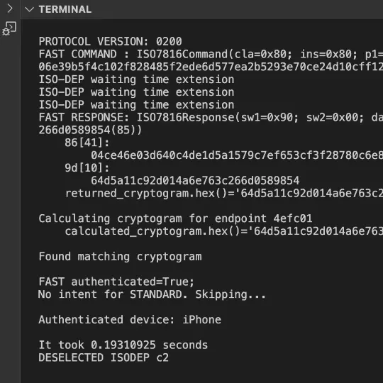

# Apple Home Key

<p float="left">
 
 
 
</p>


> [!NOTE]  
> [For fully functionall Apple Home Key Reader Implementation, visit this link](https://github.com/kormax/apple-home-key-reader)

# Overview


Apple Home Key is an NFC protocol used by select HomeKit certified locks to authenticate a user using a virtual key provisioned into their Apple device.  

There are three main components to the standard:
- Network:
  - HAP: Used to provision reader private keys, issuer keys, configure public keys of the devices that are given access to a particular Apple Home instance;
- NFC:
  - Authentication: runs on the SE and is inspired by the [Car Key](https://developer.apple.com/videos/play/wwdc2020/10006/) protocol, albeit with some changes, such as lack of direct pairing (which is done via HAP instead), changes to the KDF influcenced by multi-reader environment and other small ones;
  - Attestation exchange: implemented via HCE and uses ISO18013 engagement and NFC data transfer.  

<br>

Just like parent protocols, Home Key has following advantages:
- This protocol provides reader authentication, data encryption, forward secrecy;
- It [allows to share keys*](#key-sharing), although this functionality is not implemented;
- In theory, future locks could implement UWB-based access as it's supported by specification.


# Terminology

- Nonce - Single-use number;
- EC - Elliptic Curve;
- If a key is mentioned without algorithm info, assume its `secp256r1`;
- If a question mark is used near a word before the ending of a sentence, it means that it is an assumption.


# HomeKit


For HAP part of the Home Key, refer to comprehensive overview done by [@kupa22](https://github.com/kupa22/apple-homekey).

<sub>Previously this section contained examples of some requests with possible meaning for each of their parts. With new knowledge, previous assumptions have been deemed to be misleading, and thus have been removed.</sub>


## Key Color

**HardwareFinish of the first lock added to your home installation influences the color of the lock art for the whole home.**

Following finish variations are mentioned in IOS system files:

   | Color  | Art                                                                                  | Value      | Notes                                                                                                |
   | ------ | ------------------------------------------------------------------------------------ | ---------- | ---------------------------------------------------------------------------------------------------- |
   | Black  |    | `00 00 00` |                                                                                                      |
   | Gold   |      | `AA D6 EC` |                                                                                                      |
   | Silver |  | `E3 E3 E3` |                                                                                                      |
   | Tan    |        | `CE D5 DA` | The default color. If an unexisting color combo is chosen, this color will be selected as a fallback |

<sub>`00` also has to be appended to color value</sub>  
<sub>Credit to [@kupa22](https://github.com/kupa22/apple-homekey) for finding rest of the key colors</sub>

# NFC

## ECP

[ECP](https://github.com/kormax/apple-enhanced-contactless-polling) allows Home Keys to work via express mode and is required to be implemented by certified locks.

Full Home Key ECP frame looks like this

```
   6a 02 cb 02 06 021100 deadbeefdeadbeef
```

Following characteristics can be noted:
- It belongs to the Access(`02`) reader group  with a dedicated subtype HomeKey(`06`);
- It contains a single 3-byte TCI with a value of `02 11 00`, no other variations have been met. IOS file system contains multiple copies of a Home Key pass json with this TCI;
- The final 8 bytes of an ECP Home Key frame contain reader group identifier, which allows IOS to differentiate between keys for different Home installations.  

(NOTE) Actual reader identifier is 16 bytes long, first 8 bytes are the same for all locks in a single home, while the latter 8 are unique to each one. First 8 are used for ECP.  
(BUG) If more than one Home Key is added to a device, ECP stops working correctly, as a device responds to any reader emitting Home Key ECP frame even if the reader identifier is not known to it.  
(BUG) If you disable express mode for a single key while having multiple with enabled express mode, it won't appear on a screen when brought near to a reader. Disabling express mode for all home keys fixes this issue.

## Applets and Application Identifiers

Home Key uses two application identifiers:
1. Home Key Primary:  
    `A0000008580101`. Used for authentication. Implemented on the SE;
2. Home Key Configuration:  
    `A0000008580102`. Used for attestation exchange. Implemented via HCE. Can only be selected after a successful STANDARD authentication with a following EXCHANGE and CONTROL FLOW commands.

In most situations a reader will only use the Primary applet.  
Configuration applet will be selected only if a new device has been invited and a key data hasn't been provisioned into a lock prior to that;
Invitation is attested by the HAP pairing key of the person whom the device belongs to.


## Command overview

   | Command name                | CLA  | INS  | P1    | P2   | DATA                                                 | LE   | Response Data                                        | Notes                                                                                            |
   | --------------------------- | ---- | ---- | ----- | ---- | ---------------------------------------------------- | ---- | ---------------------------------------------------- | ------------------------------------------------------------------------------------------------ |
   | SELECT USER APPLET          | `00` | `A4` | `04`  | `00` | Home Key AID                                         | `00` | BER-TLV encoded data                                 |                                                                                                  |
   | FAST (AUTH0)                | `80` | `80` | FLAGS | TYPE | BER-TLV encoded data                                 | `00` | BER-TLV encoded data                                 | Data format described below                                                                      |
   | STANDARD (AUTH1)            | `80` | `81` | `00`  | `00` | BER-TLV encoded data                                 |      | Encrypted BER-TLV encoded data                       | Data format described below                                                                      |
   | EXCHANGE                    | `84` | `c9` | `00`  | `00` | Encrypted BER-TLV encoded data                       |      | Optional Encrypted BER-TLV encoded data              | Data format described below                                                                      |
   | CONTROL FLOW                | `80` | `3c` | STEP  | INFO | None                                                 |      | None                                                 | No data, used purely for UX                                                                      |
   | SELECT CONFIGURATION APPLET | `00` | `a4` | `04`  | `00` | Home Key Configuration AID                           | `00` | None                                                 |                                                                                                  |
   | ENVELOPE                    | `00` | `c3` | `00`  | FRMT | BER-TLV with nested NDEF or CBOR with encrypted data | `00` | BER-TLV with nested NDEF or CBOR with encrypted data | Data format described below                                                                      |
   | GET RESPONSE                | `00` | `c0` | `00`  | `00` | None                                                 | `XX` | CBOR with encrypted data                             | LE is length of data expected in response. Response data format as the one requested in ENVELOPE |


Commands are executed in a following sequence:
1. SELECT USER APPLET:  
    Reader transmits Home Key AID; Device responds with a version list TLV;
    Reader has to verify that there is a protocol version match between a list provided by a device and itself;
2. FAST:  
    Reader transmits required protocol version, transaction nonce, ephemeral public `secp256r1` key, and its identifier;  
    Device responds with an authentication cryptogram and its own ephemeral public `secp256r1` key;  
    Reader tries to verify that cryptogram was generated by a known device with a beforementioned encryption key;  
    A) If cryptograms match and there is no data to synchronize, authentication is confirmed and session is completed;  
    B) If there's a cryptogram mismatch or there is data to synchronize, we continue the command flow;
3. STANDARD:  
    Reader combines keys, nonces, other data exchanged during the transaction and signs it using its own private key;
    A device verifies that a signature is valid, and returns an encrypted payload containing signature of the transaction data using the device key;
    Common keys are established during this step to be used in FAST command in next communications. 
4. EXCHANGE:  
    Using the established encrypted channel, reader can request a switch to a configuration applet, by providing a shared secret to be used during that operation.  
    In cases when a reader does not recognize the device, the communication continues further with configuration.
*  CONTROL FLOW:
    Used in between other commands to communicate transaction state to the device. This command is reponsible for UX, such as:
    - Success checkmark;
    - Failure exclamation mark;
    - Error messages;
    - Notify about a switch to configuration applet;
5. SELECT CONFIGURATION APPLET:  
    Reader transmits Home Key Configuration AID. Device responds positively without any data;
    Re-selection is done because the device has to switch routing from the SE to HCE for attestation transfer.
6. ENVELOPE:  
    Reader transmits BER-TLV-encoded data with nested CBOR or NDEF messages.  
    First ENVELOPE command and response pair mimics ISO18013 NFC handover with NDEF.  
    Following command-response pairs mimic CBOR data transfer with nested encrypted data. Data format is the same as in ISO18013.  
    Useful payload part contains device's `secp256r1` public key used by Home Key, attested by the public `ed25519` HAP key of device owner. 
* GET RESPONSE:
    If a response to `ENVELOPE` or `GET RESPONSE` had an sw `6100`, reader uses this command to request additional response parts.
  
Alternative overview of the NFC transaction flow can be seen [here](https://github.com/kupa22/apple-homekey/#homekey-transaction-overview).

## Commands

### SELECT USER APPLET

#### Request

##### Overview

| CLA  | INS  | P1   | P2   | DATA             | LE   |
| ---- | ---- | ---- | ---- | ---------------- | ---- |
| `00` | `A4` | `04` | `00` | `A0000008580101` | `00` |

#### Response 

##### Overview

| DATA                 | SW1  | SW2  |
| -------------------- | ---- | ---- |
| Refer to data format | `90` | `00` |

Any response rather than `9000` means that applet is not available

##### Data format

| Name               | Tag  | Length | Example    | Notes                                        |
| ------------------ | ---- | ------ | ---------- | -------------------------------------------- |
| Supported versions | `5c` | 2*n    | `02000100` | First byte is major version, second is minor |

Currently only versions `0100`  and `0200` aka 1.0 and 2.0 are known

##### Data example
```
5c[04]: 
  02000100   # Supports version 2.0, and version 1.0
```

### FAST

#### Request

##### Overview

| CLA  | INS  | P1    | P2   | DATA                 | LE   |
| ---- | ---- | ----- | ---- | -------------------- | ---- |
| `80` | `80` | FLAGS | `00` | Refer to data format | None |

FLAG and TYPE parameters seem to correlate with overall transaction length;

Flag:
- `00` if intending to use STANDARD command (no cryptogram will be generated in response);
- `01` if trying to using FAST command only (still can continue with STANDARD if fail).

##### Data format

| Name                        | Tag  | Length | Example                            | Notes                                                                           |
| --------------------------- | ---- | ------ | ---------------------------------- | ------------------------------------------------------------------------------- |
| Selected protocol version   | `5c` | 2      | `0200`                             | First byte is major version, second is minor                                    |
| Reader ephemeral public key | `87` | 65     | `04`...                            | Contains an uncompressed `secp256r1` public key                                 |
| Transaction nonce           | `4c` | 16     | `deadbeefdeadbeefdeadbeefdeadbeef` | A random number used to verify that responses are generated during this session |
| Reader identifier           | `4d` | 16     | `deadbeefdeadbeefdeadbeefdeadbeef` | First 8 bytes is reader group, last 8 are unique to the reader                  |

#### Response

##### Overview

| DATA                 | SW1  | SW2  |
| -------------------- | ---- | ---- |
| Refer to data format | `90` | `00` |

Status other than `9000` cannot be encountered 

##### Data format

| Name                        | Tag  | Length | Example                            | Notes                                  |
| --------------------------- | ---- | ------ | ---------------------------------- | -------------------------------------- |
| Device ephemeral public key | `86` | 65     | `04`...                            | Uncompressed `secp256r1` public key    |
| Authentication cryptogram   | `9d` | 16     | `7656a6256aee6f9bdc55ed45d96026a3` | Optional, returned only if p1 is  `01` |


##### Data example
```
86[41]: 
  046e197441b017a6452dfe33a3645860c09a7fb34f3e84c9d6a834c737fe4e4185b37cccc2004b9cb08f837b0920d42c59ab1ce403a95cefdfe221120175f82218
9d[10]:
  7656a6256aee6f9bdc55ed45d96026a3
```


### STANDARD

> [!NOTE]
> Commands from this point on forward are not fully documented, [@kupa22's research](https://github.com/kupa22/apple-homekey?tab=readme-ov-file#homekey-transaction-overview) contains some missing pieces and pointers.  
> This section and onward fill be refactored with full info after a demo is published.

#### Request

##### Overview

| CLA  | INS  | P1   | P2   | DATA                 | LE   |
| ---- | ---- | ---- | ---- | -------------------- | ---- |
| `80` | `81` | `00` | `00` | Refer to data format | None |


##### Data format
| Name                                     | Tag  | Length | Example | Notes |
| ---------------------------------------- | ---- | ------ | ------- | ----- |
| Signature over shared info in point form | `9e` | 64     |         |       |

##### Data example
```
9e[40]:
  57a071cfeeff242878c68ef02fc430fe59cbf56741a1cadfcb0b23f962723d7321b67ab65015d50688edd17e7e658f4f6547b79bcbf9024a3bf701c216256050
```

#### Response

##### Overview

| DATA                                                         | SW1  | SW2  |
| ------------------------------------------------------------ | ---- | ---- |
| Encrypted. Exact format unknown, although there some guesses | `90` | `00` |

### COMMAND FLOW

#### Request

##### Overview

| CLA  | INS  | P1     | P2   | DATA | LE   |
| ---- | ---- | ------ | ---- | ---- | ---- |
| `80` | `3c` | STATUS | STEP | None | None |

SUCCESS is a flag that indicates transaction status:
- `00` - Failure;
- `01` - Success (Checkmark will appear);
- `40` - Need to switch to HCE applet for attestation exchange.

STEP is a second flag:
- `00` - Failure or success in normal circumstances;
- `a0` - Need to switch to HCE applet for attestation exchange.

#### Response

##### Overview

| DATA | SW1  | SW2  |
| ---- | ---- | ---- |
| None | `90` | `00` |


### SELECT CONFIGURATION APPLET

#### Request

##### Overview

| CLA  | INS  | P1   | P2   | DATA             | LE   |
| ---- | ---- | ---- | ---- | ---------------- | ---- |
| `00` | `A4` | `04` | `00` | `a0000008580102` | `00` |

#### Response 

##### Overview

| DATA | SW1  | SW2  |
| ---- | ---- | ---- |
| None | `90` | `00` |

Any response rather than `9000` means that applet is not available.
This applet is only selectable after EXCHAGNE + CONTROL FLOW (need attestation) commands have been successfuly used.  
otherwise the device will present an error and stop NFC communication.


### ENVELOPE

#### Request

##### Overview

| CLA  | INS  | P1   | P2   | DATA                                          | LE   |
| ---- | ---- | ---- | ---- | --------------------------------------------- | ---- |
| `00` | `c3` | `00` | FRMT | BER-TLV-encoded data with nested NDEF or CBOR | `00` |

FRMT real meaning is unknown, but according to observations it means the following:
- `01` NDEF nfc handover message in command and response (first command-response pair only);
- `00` CBOR message in command in response (other command-response pairs). 

#### Response 

##### Overview

| DATA                                          | SW1  | SW2  |
| --------------------------------------------- | ---- | ---- |
| BER-TLV-encoded data with nested NDEF or CBOR | `XX` | `XX` |

Status words:
   | SW1  | SW2  | Notes                                                                                  |
   | ---- | ---- | -------------------------------------------------------------------------------------- |
   | `90` | `00` | Data returned in full                                                                  |
   | `61` | `XX` | More data can be requested (00 also valid value meaning that more than 255 bytes left) |

### GET RESPONSE

#### Request

##### Overview

| CLA  | INS  | P1   | P2   | DATA | LE   |
| ---- | ---- | ---- | ---- | ---- | ---- |
| `00` | `c0` | `00` | `00` | None | `XX` |

LE should be equal to the value returned in the previous response to `ENVELOPE` or `GET RESPONSE`;

#### Response 

##### Overview

| DATA                  | SW1  | SW2  |
| --------------------- | ---- | ---- |
| TLV-encoded data/part | `XX` | `XX` |

Status words:
   | SW1  | SW2  | Notes                                                                                         |
   | ---- | ---- | --------------------------------------------------------------------------------------------- |
   | `90` | `00` | Data returned in full                                                                         |
   | `61` | `XX` | More data can be requested (00 also valid value meaning that more than 255 bytes left)                                              |


## Communication examples

Communication examples can be viewed in [resources directory](./resources/README.md).


## Extras

### Key Sharing

Unlike with Car Keys, where invited keys are attested by the key of a car owner, each Home Key is attested by the HAP (AKA issuer) keys of each particular person.  
This has following advantages:
  - People may be removed from Apple Home as they wish, as it woudn't break the attestation chain for everyone else (only the HAP key of removed person will be removed);
  - It allows for a lock to support many more enrolled devices, as the lock really only needs to permamentely store issuer keys, and a single one can attest multiple devices at a time (phone + watch).  
     Although in reality the lock still stores some amount of credentials locally (current locks report up to 16), as attestation exchange takes much longer than FAST auth (0.2sec vs 1sec);   

But there are also disadvantages:
  - Home Key protocol, unlike Car Key protocol, does not support "free" sharing natively, as it assumes that each key is bound to a particular HAP key, which automatically requires someone to be present in your Apple Home.  
  
For people who still expect sharing to happen, not all hope is lost, as:
  - Standard seems to have provisions for adding "Issuer keys" into a lock independently of HAP, but it is not known if it is actually implemented by the existing locks. 
  - Key sharing may be implemented via stub/fake/invisible HomeKit users, where an issuer key of a fake user will be used to attest a key of an invited person;

Only the time will tell if they are going to do any of that;

### Limits

During the tests, it has been found out that a single device can store up to 16 persistent keys used for FAST authentication.  
The keys are overwriten in a FIFO/Cyclic fashion, with the oldest unused one removed the first.
Even with this limitation, the possible amount of lock inside a single household is virtually unlimited, as your device will still fallback to a STANDARD authentication or even an attestation exchange if needed.

### Configuration applet

As configuration applet has to access file system to retreive the attestation package (which is up to 2kb big and stored in the file system inside the `.pkpass` files), it is thought that configuration applet is HCE, which would also explain the requirement to re-select the applet.
Configuration applet has also been tested to not work during power reserve mode, which proves that it's indeed HCE, as it doesn't operate without a powered-on operating system.

# Setting up test environment

You can start playing with Home Keys even without having a real lock. To do that:
1. First, you have to download [HAP-NodeJS](https://github.com/homebridge/HAP-NodeJS) onto your system;
2. Copy the example code [provided by @KhaosT here](https://github.com/KhaosT/HAP-NodeJS/commit/80cdb1535f5bee874cc06657ef283ee91f258815) into a new file inside the HAP directory, call it "lock.js";
3. Run the code using `node lock.js` command. Wait for initialization to complete;
4. Open the Home app on your device that resides in the same network, click "+" to add an accessory. Wait for Lock to appear (should do this really fast, otherwise verify connectivity); 
5. Add the lock, take the pairing code from the bottom of example code. During the provisioning proccess, agree to set up the home key;
6. After the initialization is complete, your Home Key should appear inside of the Wallet app.
* When adding multiple locks, don't forget to change MAC, ID, Pairing info of the new instances, as similar info might confuse HomeKit.


# Notes

- If you find any mistakes/typos or have extra information to add, feel free to raise an issue or create a PR.


# References

* Resources that helped with research:
  - Parallel Home Key protocol research project:
    - [Apple HomeKey - @kupa22](https://github.com/kupa22/apple-homekey);
  - Original inspiration:
    - [KhaosT - Home Key demo](https://twitter.com/followhomekit/status/1478489402028531712) [(Archive)](https://web.archive.org);
  - General:
    - [TLV8 format](https://pypi.org/project/tlv8/);
    - [List of digital keys in mobile wallets](https://en.wikipedia.org/wiki/List_of_digital_keys_in_mobile_wallets);
    - [IPSW.me](https://ipsw.me/product/iPhone) - used to get IOS IPSW to look for clues in a file system;
    - [TLV Utilities](https://emvlab.org/tlvutils/);
    - [ASN1 decoder](https://lapo.it/asn1js/);
    - [NDEF parser](https://ndefparser.online);
    - [CBOR playground](https://cbor.nemo157.com).
  - Source code:  
    - [Google: Identity credential](https://github.com/google/identity-credential).
  - Apple resources:
    - [Apple Developer Documentation](https://developer.apple.com/documentation/);
    - [WWDC Introducting "Home Keys" (I'm not kidding)](https://developer.apple.com/videos/play/wwdc2020/10006/);
    - [Unlock your door with a home key on iPhone](https://support.apple.com/en-gb/guide/iphone/iph0dc255875/ios);
  - Device brochures:  
    - [Aqara A100 Zigbee](https://www.aqara.com/en/product/smart-door-lock-a100-zigbee);
    - [Aqara D100 Zigbee](https://www.aqara.com/en/product/smart-door-lock-d100-zigbee);
    - [Aqara Smart Lock U100](https://www.aqara.com/en/product/smart-lock-u100);
    - [Schlage encode plus](https://www.schlage.com/en/home/smart-locks/encode-plus.html);
    - [Level Lock +](https://level.co/shop/level-lock-plus);
    - [TUO Smart Lock](https://findtuo.com/pages/smart-lock).
* Devices and software used for analysis:
  - [HAP-NodeJS](https://github.com/homebridge/HAP-NodeJS) - used to create virtual lock instances in order to look at communication and data structures;
  - Proxmark3 Easy - used to sniff Home Key transactions. Proxmark3 RDV2/4 can also be used;
  - [Proxmark3 Iceman Fork](https://github.com/RfidResearchGroup/proxmark3) - firmware for Proxmark3.
